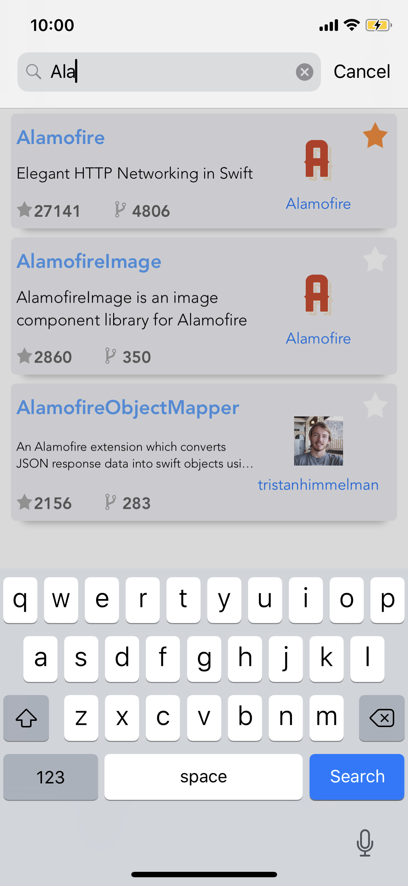
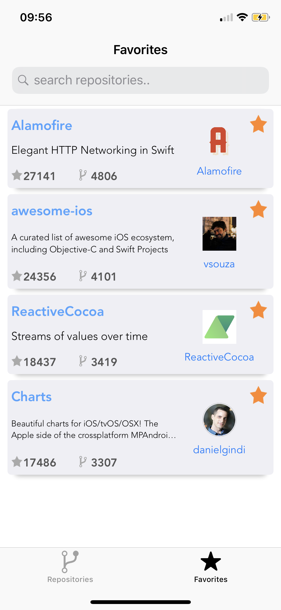
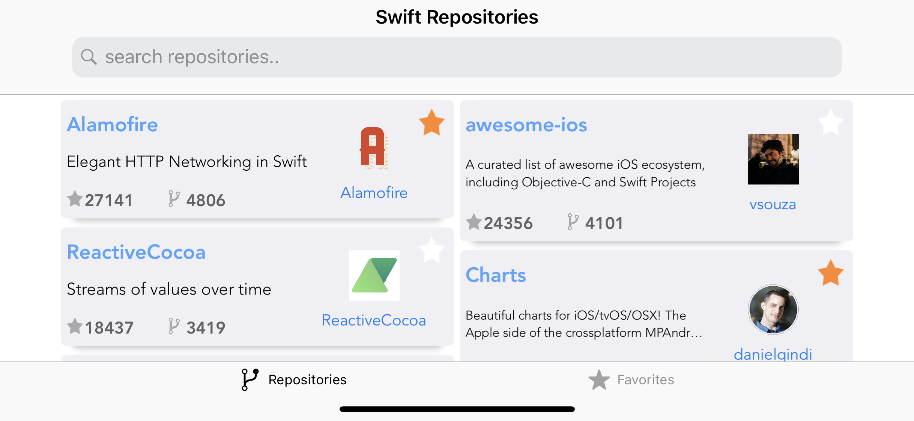
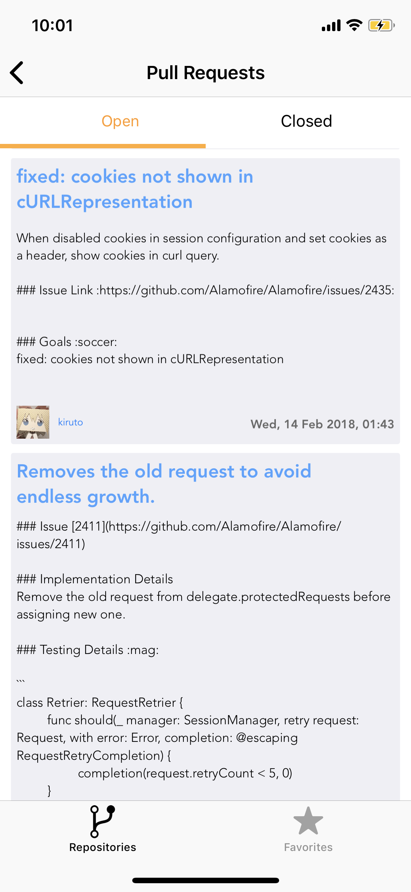
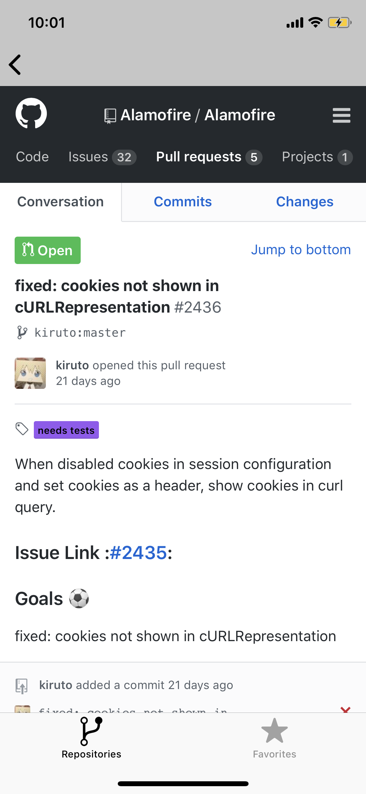

# swift-repositories

[](https://travis-ci.org/marinofelipe/swift-repositories)
[](https://coveralls.io/github/marinofelipe/swift-repositories?branch=master)

# Swift Repositories
Shows swift repositories ordered by stars. <br>
User is able to favorite by selecting the repository star button or dragging to the favorites screen. <br>
The transition to and from pull requests were made to make the app more elegant. <br>
Offline persistence is working and the app can be used in landscape as well.

# Setup 
Install [CocoaPods](https://cocoapods.org)

```$ sudo gem install cocoapods```

Add your TOKEN to info.plist "ApiToken" key
- In your github profile go to "Settings -> Developer Settings -> Personal access token"
- Generate a new token with "repo" scope enabled
- Copy your token, then after opening the project in Xcode, select Info.plist and paste in ApiToken key

# How to Compile

```$ git clone https://github.com/marinofelipe/swift-repositories.git```

Install dependencies

```$ pod install```

# Screenshoots

Search             |  Favorites                 
:-------------------------:|:-------------------------:|
  |   

Landscape
:-------------------------:


Pull Requests             |  Web View                
:-------------------------:|:-------------------------:|
 | 
